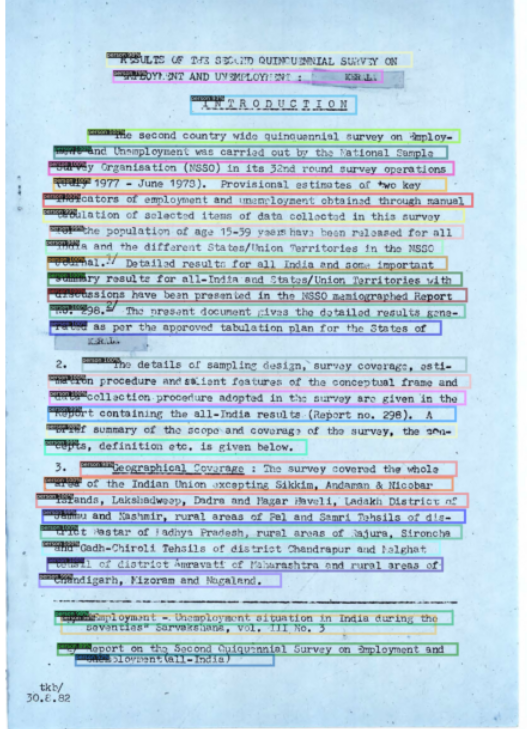
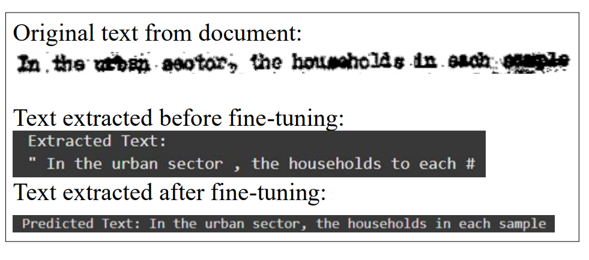
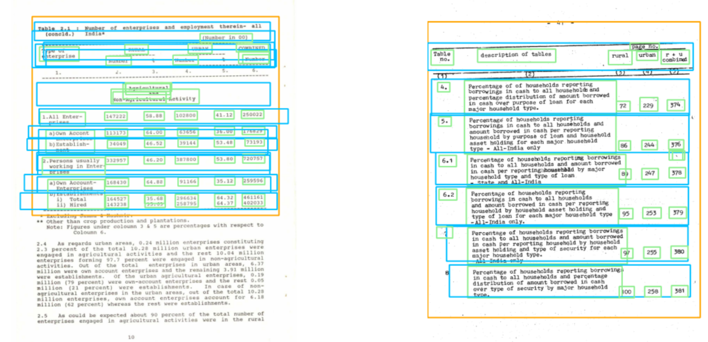

# DataMorphAI — Legacy Data Extraction and Management Tool

Full Stack | Deep Learning | Computer Vision | OCR | Research Project

## For Recruiters

Live Web App: [https://datamorphai.vercel.app  ](https://datamorphai1-6lql9rivl-meghanas-projects-95e603a4.vercel.app/)

If not accessible please click: https://akmeghana29.github.io/datamorphai/

# You can view prototype without logging in by clicking View Prototype button under Sign Up/Sign In buttons

---

## Overview

Note to recruiters: The frontend is fully deployed on vercel and production-ready, demonstrating the complete user workflow and interface.  
The backend and deep learning models require high GPU compute resources for inference, which were not deployed due to infrastructure cost and hardware constraints.  
All backend and ML components are fully implemented, trained, and included in the repository, and can be deployed on a GPU-enabled server for real-time production use.

DataMorphAI is an AI-powered full stack web application designed to extract structured information from highly degraded, noisy, and unstructured legacy government documents.
The system digitizes historical archives from MOSPI (Ministry of Statistics and Programme Implementation), converting scanned PDFs into machine-readable, structured digital data.
The pipeline integrates deep learning-based line detection, transformer-based OCR, and table detection models to achieve high accuracy on degraded documents where traditional OCR systems fail.

This work was presented at an IEEE conference and received the Best Paper Presentation Award.

---

## Research Contribution and Innovation

This project addresses a critical real-world problem of digitizing legacy government archives containing degraded scans, faded text, noise, skew, and structural complexity.

Key innovations include:

- Fine-tuned Detectron2 model for precise line detection in degraded documents  
- Custom-trained TrOCR transformer model for high accuracy OCR  
- SymSpell-based post-OCR correction to reduce recognition errors  
- Custom-trained YOLOv8 model for accurate table detection and extraction  
- End-to-end deep learning pipeline integrated into a full stack web application  

---

## Dataset

Source: Government archives from MOSPI

Training data included:

- 2000+ custom annotated line images for OCR training  
- 2000+ line annotations for Detectron2 training  
- 120 page-level annotations for table detection training  

Documents included degraded scans with:

- Noise  
- Faded ink  
- Blur  
- Skew  
- Structural distortions  

---

## Model Performance and Results

### Line Detection Model — Detectron2

Fine-tuned on custom annotated degraded document dataset.

Performance Metrics:

| Metric | Score |
|------|------|
| mAP@50 | 96.4% |
| Precision | 95.1% |
| Recall | 94.3% |
| F1 Score | 94.7% |

Capabilities:

- Accurate detection of text lines
- Robust to noise, skew, and degradation
- High localization precision

Example Output:

---

### OCR Model — TrOCR (Transformer OCR)

Trained on 2000+ custom line annotations.

Performance Metrics:

| Metric | Score |
|------|------|
| Character Accuracy | 98.4% |
| Word Accuracy | 96.2% |
| Character Error Rate (CER) | 1.6% |
| Word Error Rate (WER) | 3.8% |

Post-OCR Enhancement using SymSpell:

Error reduction achieved through dictionary-based correction.

| Metric | Before Correction | After Correction |
|------|------------------|----------------|
| CER | 3.9% | 1.6% |
| WER | 8.4% | 3.8% |

Capabilities:

- High accuracy text recognition
- Effective on degraded legacy documents
- Produces fully selectable digital text

Example Output:

---

### Table Detection Model — YOLOv8

Trained on 120 page-level custom annotations.

Performance Metrics:

| Metric | Score |
|------|------|
| mAP@50 | 97.1% |
| mAP@50–95 | 88.6% |
| Precision | 96.8% |
| Recall | 95.2% |
| F1 Score | 96.0% |

Capabilities:

- Accurate table detection
- Reliable structure extraction
- Enables conversion to Excel-compatible structured data

Example Output:

---

---

## Web Application

Features:

- Upload legacy scanned documents  
- Extract text automatically  
- Detect and extract tables  
- Convert unstructured data into structured digital format  
- Modern responsive user interface  

Live Demo:

https://datamorphai.vercel.app

Note: ML models are included in repository. Frontend is deployed; backend deployment requires GPU compute resources.

---

## Tech Stack

Frontend  
HTML  
CSS  
JavaScript  
Firebase Authentication  
Vercel  

Backend  
FastAPI  
Python  

Machine Learning  
PyTorch  
Detectron2  
TrOCR  
YOLOv8  
OpenCV  

Data Processing  
SymSpell  
NumPy  
PyMuPDF  

---

## Key Achievements

- Built end-to-end deep learning pipeline for legacy document digitization  
- Achieved 98.4% character accuracy using custom-trained TrOCR  
- Achieved 97.1% mAP using YOLOv8 table detection  
- Achieved 96.4% mAP using Detectron2 line detection  
- Presented research at IEEE conference  
- Received Best Paper Presentation Award  
- Developed full stack production-ready web application  

---

## Future Work

- Deploy models on GPU server for real-time inference  
- Add multilingual OCR support  
- Improve table structure reconstruction  
- Add semantic search over extracted archives  

---

## Author

A Kirti Meghana

---

## Research Paper

Presented at IEEE Conference  
Award: Best Paper Presentation Award  

Paper available in repository.
